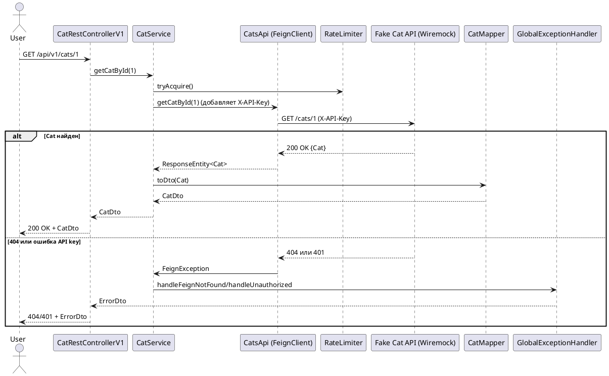

# Cat API Integration Service

> **Spring Boot микросервис для интеграции с внешним REST API котов (Wiremock), демонстрирующий современные best practices: OpenAPI, Feign, MapStruct, Resilience4j, централизованная обработка ошибок, интеграционные тесты и готовность к production.**

---

## Оглавление

1. [Описание и особенности](#описание-и-особенности)
2. [Структура проекта](#структура-проекта)
3. [Архитектура (C4 диаграммы)](#архитектура-c4-диаграммы)

  * [C4 Context](#c4-context)
  * [C4 Container](#c4-container)
  * [C4 Component](#c4-component)
  * [Sequence Diagram](#sequence-diagram)
4. [OpenAPI спецификация](#openapi-спецификация)
5. [Инструкция по запуску](#инструкция-по-запуску)
6. [Тестирование](#тестирование)
7. [Описание ключевых компонентов](#описание-ключевых-компонентов)
8. [Пример ошибок и ErrorDto](#пример-ошибок-и-errordto)
9. [Контакты и обратная связь](#контакты-и-обратная-связь)

---

## Описание и особенности

**Cat API Integration** — Spring Boot микросервис, демонстрирующий лучшие практики интеграции с внешним REST API на примере работы с фейковым Cat API (Wiremock).

**В проекте реализовано:**

* OpenAPI-first подход: автогенерация клиента по спецификации
* Интеграция через Feign + Resilience4j RateLimiter
* Централизованный обработчик ошибок (GlobalExceptionHandler)
* DTO и маппинг через MapStruct 
* Интеграционные и контрактные тесты (WireMock, Testcontainers)
* Production-ready инфраструктура (Docker, Docker Compose, healthchecks)
* Унифицированный формат ошибок (ErrorDto)

---

## Структура проекта

```
src/
 ├─ main/java/net/proselyte/catapiintegration
 │   ├─ config/            # Конфиги Feign, Resilience4j
 │   ├─ dto/               # CatDto, ErrorDto
 │   ├─ exceptionhandler/  # Exception'ы + глобальный обработчик
 │   ├─ mapper/            # MapStruct CatMapper
 │   ├─ rest/              # CatRestControllerV1
 │   ├─ service/           # CatService (логика)
 │   ├─ api/, model/, invoker/ # генерируются по OpenAPI (Gradle)
 ├─ test/java/net/proselyte/catapiintegration/it/
 │   └─ CatRestControllerV1IntegrationTest
 ├─ test/resources/wiremock/mappings/
 │   └─ ...JSON-стабы для Wiremock
docker/
 └─ fake-cat-api-mappings/
     └─ ...JSON для ручного/stub-развёртывания
```

---

## Архитектура (C4 диаграммы)

### C4 Context

```plantuml
@startuml C4_Context_CatIntegration
!includeurl https://raw.githubusercontent.com/plantuml-stdlib/C4-PlantUML/master/C4_Context.puml

Person(user, "User", "Клиент сервиса (UI, другой сервис)")
System(system, "Cat API Integration Service", "Spring Boot", "REST API для работы с котами")
System_Ext(fakeCatApi, "Fake Cat API (Wiremock)", "REST API", "Внешний сервис с данными о котах")

Rel(user, system, "REST /api/v1/cats")
Rel(system, fakeCatApi, "Feign, X-API-Key")
@enduml
```

### C4 Container

```plantuml
@startuml C4_Container_CatIntegration
!includeurl https://raw.githubusercontent.com/plantuml-stdlib/C4-PlantUML/master/C4_Container.puml

System_Boundary(system, "Cat API Integration") {
    Container(rest, "REST Controller", "Spring Boot", "/api/v1/cats")
    Container(service, "CatService", "Java Service", "Интеграция, логика, вызов Feign, RateLimiter")
    Container(mapper, "CatMapper", "MapStruct", "Маппинг Cat → CatDto")
    Container(feign, "CatsApi (FeignClient)", "Spring Cloud OpenFeign", "Генерируемый по OpenAPI, добавляет X-API-Key")
    Container(exception, "GlobalExceptionHandler", "Spring @ControllerAdvice", "Обработка ошибок/генерация ErrorDto")
    Container(ratelimiter, "RateLimiter", "Resilience4j", "Ограничивает запросы к Fake Cat API")
}
System_Ext(fakeCatApi, "Fake Cat API (Wiremock)", "REST API", "Сервис-стаб котов, ждет X-API-Key")

Rel(rest, service, "Вызов логики")
Rel(service, feign, "REST-запросы к Wiremock")
Rel(service, ratelimiter, "Ограничение RPS")
Rel(service, mapper, "Маппинг сущностей")
Rel(feign, fakeCatApi, "GET /cats, /cats/{id} (X-API-Key)")
Rel(rest, exception, "Обработка исключений")
@enduml
```

### C4 Component

```plantuml
@startuml C4_Component_CatIntegration
!includeurl https://raw.githubusercontent.com/plantuml-stdlib/C4-PlantUML/master/C4_Component.puml

Container(rest, "REST Controller", "Spring Boot", "API: /api/v1/cats")
Component(service, "CatService", "Бизнес-логика")
Component(mapper, "CatMapper", "MapStruct")
Component(feign, "CatsApi (FeignClient)", "OpenFeign + OpenAPI")
Component(ratelimiter, "RateLimiter", "Resilience4j")
Component(exception, "GlobalExceptionHandler", "ControllerAdvice")

Rel(rest, service, "getCats, getCatById")
Rel(service, feign, "catsApi.getCats(), getCatById()")
Rel(service, ratelimiter, "decorateSupplier")
Rel(service, mapper, "toDto, toDtoList")
Rel(rest, exception, "Обработка FeignException/RuntimeException")
@enduml
```

### Sequence Diagram



---

## OpenAPI спецификация

(см. файл `api/fake-cat-api.yaml` в проекте)

<details>
<summary>Пример OpenAPI YAML</summary>

```yaml
openapi: 3.0.1
info:
  title: Fake Cat API
  version: '1.0'
servers:
  - url: http://fake-cat-api:8080
paths:
  /cats:
    get:
      tags: [Cat]
      summary: Get list of cats
      operationId: getCats
      security: [ApiKeyAuth: []]
      responses:
        '200':
          description: OK
          content:
            application/json:
              schema:
                type: array
                items:
                  $ref: '#/components/schemas/Cat'
  /cats/{id}:
    get:
      tags: [Cat]
      summary: Get cat by ID
      operationId: getCatById
      security: [ApiKeyAuth: []]
      parameters:
        - name: id
          in: path
          required: true
          schema: { type: integer, format: int64 }
      responses:
        '200': { description: Cat found, content: { application/json: { schema: { $ref: '#/components/schemas/Cat' } } } }
        '404': { description: Cat not found }
components:
  securitySchemes:
    ApiKeyAuth: { type: apiKey, in: header, name: X-API-Key }
  schemas:
    Cat:
      type: object
      properties:
        id:    { type: integer, format: int64 }
        name:  { type: string }
        breed: { type: string }
        age:   { type: integer }
```

</details>

---

## Инструкция по запуску

### 1. Клонировать репозиторий

```bash
git clone https://github.com/<your-repo>/catapiintegration.git
cd catapiintegration
```

### 2. Запуск через Docker Compose

```bash
docker compose up --build
```

Поднимутся два контейнера:

* **cat-integration-app** (Spring Boot, порт 8088)
* **fake-cat-api** (Wiremock, порт 8081, ожидает X-API-Key: demo-secret-key)

### 3. Примеры запросов

**Получить список котов:**

```bash
curl -H "X-API-Key: demo-secret-key" http://localhost:8088/api/v1/cats
```

**Получить кота по id:**

```bash
curl -H "X-API-Key: demo-secret-key" http://localhost:8088/api/v1/cats/1
```

**Ошибка (нет API-ключа):**

```bash
curl http://localhost:8088/api/v1/cats
```

```json
{
  "message": "Missing of incorrect API key",
  "code": "CAT_API_UNAUTHORIZED",
  "timestamp": "2025-07-15T12:34:56.789123",
  "path": "/api/v1/cats"
}
```

---

## Тестирование

В проекте реализованы **интеграционные тесты**:

* запуск:

  ```bash
  ./gradlew clean test
  ```
* используются MockMvc + WireMockExtension (stub mappings в `src/test/resources/wiremock/mappings`)
* тестируются все ключевые сценарии: 200/401/404/invalid API key/ratelimiter.

---

## Описание ключевых компонентов

| Компонент              | Назначение                                |
| ---------------------- | ----------------------------------------- |
| CatRestControllerV1    | REST API /api/v1/cats, /api/v1/cats/{id}  |
| CatService             | Бизнес-логика, интеграция, rate-limiting  |
| CatsApi                | Feign-клиент к внешнему Cat API (OpenAPI) |
| CatMapper              | MapStruct, преобразование Cat → CatDto    |
| GlobalExceptionHandler | Единая обработка ошибок и выдача ErrorDto |
| RateLimiter            | Resilience4j, контроль RPS                |

---

## Пример ошибок и ErrorDto

```json
{
  "message": "Cat not found in the external API",
  "code": "CAT_API_ITEM_NOT_FOUND",
  "timestamp": "2025-07-15T13:00:00.000",
  "path": "/api/v1/cats/404"
}
```
---

| Ветка      | Описание изменений                                                                |
| ---------- |-----------------------------------------------------------------------------------|
| **STEP-1** | Начальная версия проекта                                                          |
| **STEP-2** | Добавлен docker-compose с контейнером Wiremock                                    |
| **STEP-3** | Добавлены автогенерируемые клиенты (OpenAPI) и конфигурации                       |
| **STEP-4** | Реализована интеграция с FAKE-CAT-API (Feign, MapStruct, RateLimiter)             |
| **STEP-5** | Интеграционные тесты, Dockerfile, обновленный docker compose, финальный README.md |


---

## Контакты и обратная связь

* Telegram: [@proselyte](https://t.me/esuleimanov)
* Github: [Eugene Suleimanov](https://github.com/proselytear)

---